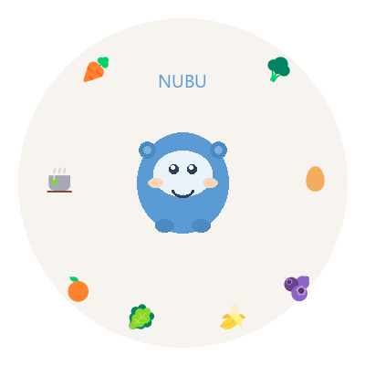

# NUBU - NUtrition builds a Better yoU! 🥦🥕🍊

  

  <a href="nubu-landing.html">See the animated version</a>

NUBU is a personal nutrition tracking tool that helps you understand what you're eating, identify nutrient gaps, and build better habits over time.

## What It Does

- **Natural language food logging** - Just say what you ate ("2 eggs, toast with jelly, black tea")
- **Full nutrient analysis** - Tracks 26+ nutrients including vitamins, minerals, and macros
- **Saved meals** - Store common meals so you don't retype them every day
- **Gap detection** - Highlights nutrients you're low on and suggests foods to fix it
- **Visual dashboard** - Color-coded progress bars show where you stand daily

## Tracked Nutrients

**Macros:** Calories, Protein, Fat, Saturated Fat, Carbs, Fiber, Sugar

**Vitamins:** A, C, D, E, K1, K2, Thiamin, Riboflavin, Niacin, B6, Folate, B12

**Minerals:** Calcium, Iron, Magnesium, Phosphorus, Potassium, Sodium, Zinc, Selenium

## Data Source

Nutrient data powered by [USDA FoodData Central](https://fdc.nal.usda.gov/).

## Architecture

- **Storage:** Excel workbook (easy backup, lives in OneDrive)
- **Dashboard:** Self-contained HTML with visual nutrient progress bars
- **Lookup:** USDA FoodData Central API for precise nutrient values
- **Interface:** Copilot CLI skill for natural language input

## Getting Started

1. Get a free USDA API key at https://fdc.nal.usda.gov/api-key-signup.html
2. Clone this repo
3. Open `index.html` to see the animated landing page
4. Check `dashboard/nutrition-dashboard.html` for the daily tracker view

## Future Plans

- Blood test result comparison (intake vs. measured levels)
- Exercise logging and calorie adjustment
- Weekly/monthly trend reports
- Supplement tracking
- Water intake

## Part of the "Better yoU" Family

NUBU is a companion to [BABU (Be A Better yoU!)](https://github.com/bethz/babu-communication-coach), a communication coaching tool.

---

*Built with care by Beth Zeranski*
